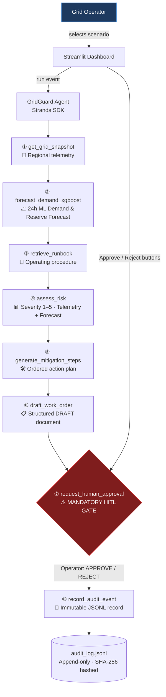

# GridGuard Strands Operations Autopilot

> **Autonomous grid-operations triage · Human-governed decisions · Immutable audit trail**  
> AWS "Agents for Humans" Hackathon — Professional Agents Track

[](https://www.python.org/)
[](https://strandsagents.com)
[](LICENSE)
[](.env.example)

---

## What It Does

Grid and utility operations teams spend significant time repeatedly triaging risk signals, checking runbooks, creating mitigation recommendations, and preparing work orders. **GridGuard Strands Operations Autopilot** is an autonomous-but-human-governed agent that handles this repetitive structured work — and only escalates when an operator decision is needed.

The agent ingests a simulated grid-risk event (severe weather, rising demand, equipment risk, or outage warning), runs a structured eight-step workflow through Strands tool functions, and surfaces every decision in a clean Streamlit dashboard — including a **mandatory human approval gate** before any action becomes active.

> ⚠️ **Safety Boundary**: This system operates entirely on synthetic/simulated data. It does not connect to, monitor, or control any real electric grid, generation asset, transmission infrastructure, or customer load. All drafted actions are recommendations; a human operator makes every final decision.

---

## Architecture



---

## Quick Start (Local Demo — No API Keys Needed)

### Prerequisites
- Python 3.11+
- `pip` or `uv`

### 1. Clone & Install

```bash
git clone https://github.com/draculess99/GridGuard-Strands-Autopilot.git
cd GridGuard-Strands-Autopilot
pip install -e ".[dev]"
```

### 2. Configure environment

```bash
cp .env.example .env
# No changes needed for MOCK_MODE demo — leave MOCK_MODE=true
```

### 3. Run the CLI demo

```bash
python scripts/run_demo.py                          # SEVERE_WEATHER scenario
python scripts/run_demo.py --scenario HIGH_DEMAND   # High demand scenario
python scripts/run_demo.py --scenario EQUIPMENT_RISK --approve  # auto-approve
```

### 4. Run the Streamlit dashboard

```bash
streamlit run dashboard/app.py
```
Open http://localhost:8501 — select a scenario, click **Run Agent Workflow**, then use the **Approve / Reject** buttons.

### 5. Run tests

```bash
pytest tests/ -v --tb=short
```

Expected: **all 56 tests pass** with zero cloud credentials.

---

## Workflow Steps

| # | Step | Tool | Description |
|---|------|------|-------------|
| 1 | Grid Snapshot | `get_grid_snapshot` | Retrieves current demand, capacity, reserve, frequency for the region |
| 2 | Demand Forecast | `forecast_demand_xgboost` | 24-hour ML forecast: peak MW, reserve margin %, high-risk hours |
| 3 | Runbook | `retrieve_runbook` | Fetches the relevant standard operating procedure |
| 4 | Risk Assessment | `assess_risk` | Scores severity 1–5 using current telemetry and XGBoost forecast impact |
| 5 | Mitigation Plan | `generate_mitigation_steps` | Generates ordered, role-assigned action steps from the runbook catalogue |
| 6 | Work Order | `draft_work_order` | Formats a structured DRAFT work order document |
| 7 | ⚠️ **HITL Gate** | `request_human_approval` | **Mandatory** — suspends until operator Approves or Rejects |
| 8 | Audit Record | `record_audit_event` | Writes SHA-256-hashed immutable record to `data/audit_log.jsonl` |

---

## Dashboard Sections

1. **Ingested Event** — event title, description, ID, severity badge
2. **Workflow Timeline** — all 8 steps with status badges and elapsed time
3. **Risk Assessment** — severity gauge, load factor, reserve margin, and explicit XGBoost forecast impact
4. **XGBoost Forecast** — peak demand, available capacity, projected reserve margin, and hourly trajectory chart
5. **Grid Snapshot** — regional telemetry at-a-glance
6. **Mitigation Plan** — ordered step cards with responsible roles and timeframes
7. **Work Order Draft** — structured document with Approve / Reject HITL buttons
8. **Operational Runbook** — full runbook for the event type
9. **Audit Trail** — paginated immutable event log with SHA-256 hash display

---

## Demo Scenarios

| Scenario | Description | Default Severity |
|---|---|---|
| `SEVERE_WEATHER` | Ice storm approaching — demand surge expected | HIGH (4/5) |
| `HIGH_DEMAND` | Load approaching N-1 contingency threshold | HIGH (4/5) |
| `EQUIPMENT_RISK` | Transformer DGA alert — Health Index < 0.65 | MEDIUM (3/5) |
| `OUTAGE_WARNING` | Scheduled maintenance conflict — N-1 violation risk | MEDIUM (3/5) |

---

## Project Structure

```
GridGuard-Strands-Autopilot/
├── gridguard/
│   ├── agent.py                # Strands Agent + mock workflow engine
│   ├── config.py               # Pydantic-settings configuration
│   ├── logger.py               # Structured JSON logger
│   ├── data/
│   │   ├── synthetic_events.py # Canonical event generator
│   │   └── runbooks.py         # Static runbook store
│   ├── models/
│   │   └── xgboost_demand_model.json # Serialized XGBoost model artifact
│   └── tools/
│       ├── grid_snapshot.py    # get_grid_snapshot()
│       ├── forecast.py         # forecast_demand_xgboost()  ← ML forecaster
│       ├── runbook.py          # retrieve_runbook()
│       ├── risk_assessor.py    # assess_risk()
│       ├── mitigation.py       # generate_mitigation_steps()
│       ├── work_order.py       # draft_work_order()
│       ├── human_approval.py   # request_human_approval()  ← HITL gate
│       └── audit.py            # record_audit_event()
├── dashboard/
│   └── app.py                  # Streamlit dashboard
├── scripts/
│   └── run_demo.py             # Rich CLI demo runner
├── tests/
│   ├── conftest.py
│   ├── test_tools.py           # 30+ unit tests (including XGBoost)
│   ├── test_workflow.py        # Integration tests (all 4 scenarios)
│   └── test_audit.py           # Audit trail tests
├── .github/workflows/
│   └── ci.yml                  # GitHub Actions CI (Python 3.11 / 3.12)
├── .env.example
├── pyproject.toml
└── README.md
```

---

## Configuration Reference

| Variable | Default | Description |
|---|---|---|
| `MOCK_MODE` | `true` | `true` = full demo, zero cloud calls. `false` = live Bedrock briefing mode. |
| `STRANDS_PROVIDER` | `bedrock` | Active provider: `bedrock` or `anthropic` |
| `AWS_REGION` | `us-east-1` | AWS region for Amazon Bedrock |
| `BEDROCK_MODEL_ID` | `anthropic.claude-3-5-haiku-20241022-v1:0` | Small, cost-conscious Bedrock model |
| `LIVE_RUN_LIMIT` | `5` | Process-level ceiling on live calls to prevent runaway spend |
| `LIVE_MAX_OUTPUT_TOKENS` | `600` | Concise output token cap on model briefings |
| `LIVE_TEMPERATURE` | `0.2` | Sampling temperature for deterministic briefing |
| `ANTHROPIC_API_KEY` | *(empty)* | Optional: Required only if `STRANDS_PROVIDER=anthropic` |
| `AUDIT_LOG_PATH` | `data/audit_log.jsonl` | Append-only audit log path |
| `LOG_LEVEL` | `INFO` | Structured JSON log level |

---

## Safe, Bounded Live Amazon Bedrock Mode

When `MOCK_MODE=false`, GridGuard uses a real **Strands Agent** backed by **Amazon Bedrock** to generate an evidence-grounded **Operator Briefing**.

### Cost & Safety Safeguards
1. **Zero Retries / Single Invocation**: The briefing agent is bounded to exactly 1 turn (`Limits(turns=1, output_tokens=600)`) with zero retries (`ModelRetryStrategy(max_attempts=1)`). No background polling, loops, memory storage, or external searches.
2. **Process-Level Run Limit**: Governed by `LIVE_RUN_LIMIT=5` (configurable). Once reached, the application locks out further live calls until restart.
3. **Dashboard Authorization Gate**: Before any live Bedrock request is executed from the Streamlit UI, the operator must explicitly check the confirmation box: `"I confirm I want to call Amazon Bedrock"`.
4. **Deterministic Authority**: The LLM *cannot* modify XGBoost forecast numbers, risk severity scores, mitigation steps, work order numbers, or the approval gate. All governance remains 100% deterministic in Python.
5. **Secret Redaction**: AWS secret keys, access keys, and tokens are automatically scrubbed from structured JSON logs.
6. **Graceful Fallback**: If Bedrock is throttled, unavailable, or credentials fail, the workflow continues deterministically without bypassing human approval or corrupting audit integrity.

### Configuring Your First Live Run
1. Ensure model access is enabled for `anthropic.claude-3-5-haiku-20241022-v1:0` in your AWS region (e.g. `us-east-1` or `us-west-2`).
2. Create your `.env` file:
   ```bash
   MOCK_MODE=false
   STRANDS_PROVIDER=bedrock
   AWS_REGION=us-east-1
   AWS_ACCESS_KEY_ID=AKIA...
   AWS_SECRET_ACCESS_KEY=...
   LIVE_RUN_LIMIT=5
   ```
3. Run the dashboard or CLI demo:
   ```bash
   streamlit run dashboard/app.py
   # Or run via CLI:
   python scripts/run_demo.py --scenario SEVERE_WEATHER --approve
   ```

---

## Safety Boundaries

1. **Synthetic data only** — All grid data, asset IDs, and scenarios are fabricated.
2. **No real infrastructure** — The system has no connection to any operational technology (OT), SCADA, EMS, or DMS.
3. **Human approval mandatory** — No drafted action can proceed without explicit operator approval via the `request_human_approval` tool.
4. **Immutable audit trail** — Every decision is recorded with a SHA-256 content hash.
5. **Clearly labelled** — All tool outputs include `data_source: SYNTHETIC_DEMO`.

---

## Prior Work Disclosure

This project was built during the AWS Agents for Humans Hackathon submission period.

- **Originating Prior Work**: The XGBoost demand forecasting pipeline (19 autoregressive/cyclical features, recursive multi-step forecasting, and hyperparameter configuration) and synthetic grid-domain assumptions originate from the author's earlier GridGuard AI exploration.
- **New Work Built for This Hackathon**: The entire agentic system and AWS-ready architecture are genuinely new and built specifically for this submission:
  - Strands Agents SDK integration with typed `@tool` registry
  - 8-step autonomous-but-human-governed workflow
  - Deterministic zero-token mock workflow engine
  - Non-skippable Human-in-the-Loop (HITL) approval gate
  - Streamlit operations dashboard with forecast trajectory chart and risk explanation
  - Append-only SHA-256 tamper-evident JSONL audit trail
  - GitHub Actions multi-version CI pipeline (Python 3.11 / 3.12)
  - 56-test automated test suite (100% passing offline without credentials)

---

## Screenshots

*[Screenshots will be added after the Streamlit dashboard is running — run `streamlit run dashboard/app.py` to see the live interface.]*

---

## License

MIT — see [LICENSE](LICENSE).
